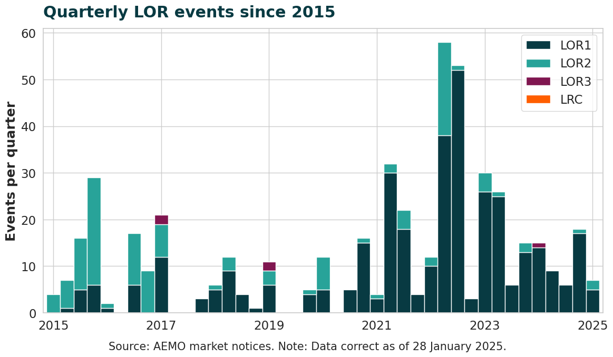

# LER event summaries

## Purpose
This application summarises historic lack of reserve (LOR) events in the National Electricity Market.

---
## Outputs

The application produces two data files and a chart, which are stored in the `./data/` sub-directory.

1. **All LOR event notices**: The file `lor_events.csv` lists all LOR events with these variables:
    - *notice_date*: the date and time of the declaration
    - *region*: the state or market
    - *type*: the LOR event level, eg. 'LOR1', 'LOR2', 'LOR3'
    - *reference*: the summary of the market notice

The earliest LOR event declaration in the NEM was made on 4 January 2001 in South Australia, for an LOR2.

2. **Quarterly summary**: The file `lor_events_quarters.csv` lists the number of each *type* of LOR per quarter, from 10 years before the current year.

2. **LOR chart**: The file `lor_events_chart.png` visualises the quarterly summary. The latest chart is below:



---
## Using this app

Open the command line in this directory (`lor_events`).

If it is the first time you are using this app, install the required Python modules:

```
pip install -r requirements.txt
```
You can then run the app:

```
py lor_events.py
```

[def]: ./data/lor_events_chart.png